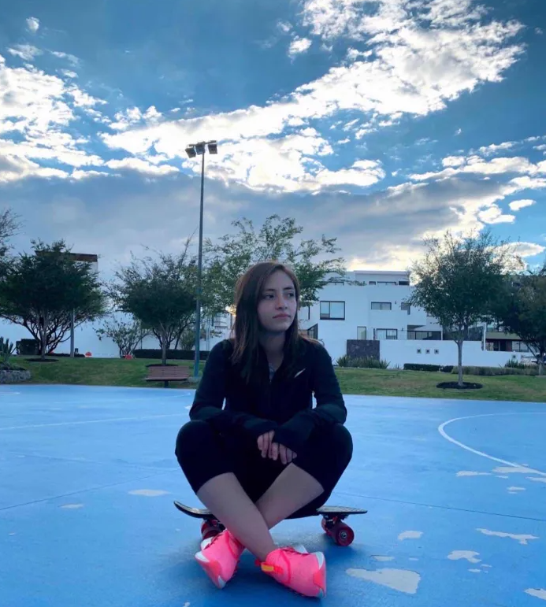

# Giselle Gallegos

## Presentacion 
Estudio Desarrollo de Videojuegos y escogi esta carrera porque siempre me ha interesado el detras de un videojuego, de chica me gustaba usar scratch y de ahi me intereso el codigo escrito. Espero poder trabajar con alguna empresa grande de videojuegos, hacer mi propio estudio o incluso poderme dedicar a varias ramas como programacion web, etc.

## Pasatiempos favoritos
1. Programar paginas web especialmente sobre juegos de azar
2. Hacer ejercicio
3. Jugar videojuegos
4. Jugar y pasear con mis mascotas

## Mis contactos
- [Instagram](https://www.instagram.com/giselle.fgr?igsh=MTB5emkzanU3N3Fraw==)
- Numero: 5530279151

## Foto

## Entregables
- [Practica1](mds/apuntes.md)
- [Practica2](mds/ramas-fusiones.md)
- [Practica3](mds/etiquetas.md)
- [Practica4](mds/primer-parcial.md)