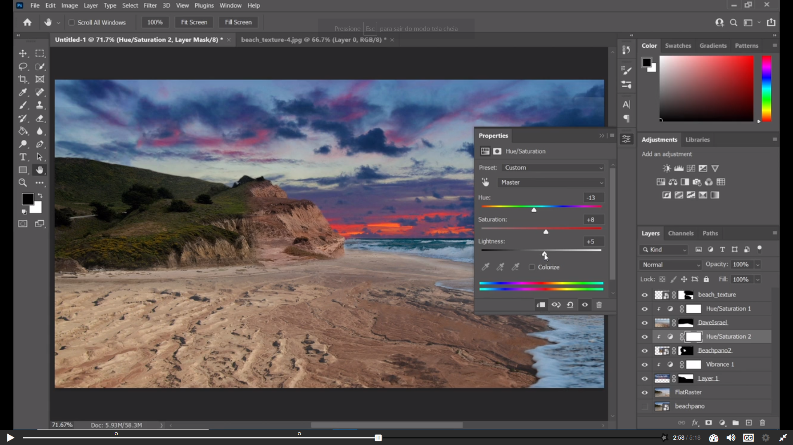

# Asignatura 3DEVs
## Principios de Composicion y Diseño 
### Roberto Melo
Estamos aprendiendo a usar Photoshop la verdad esta muy interesante, por ahora estamos llevando puro photoshop y me esta gustando, nos enseño ya a fusionar distintas imagenes y todo

