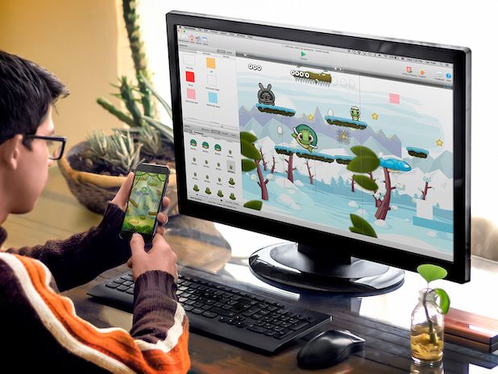
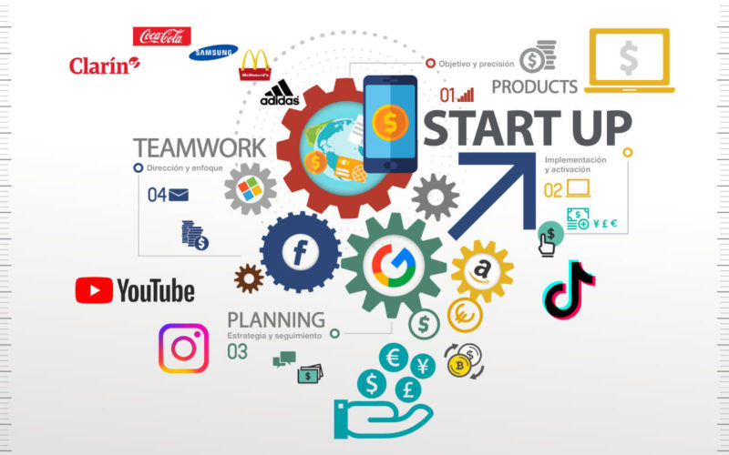
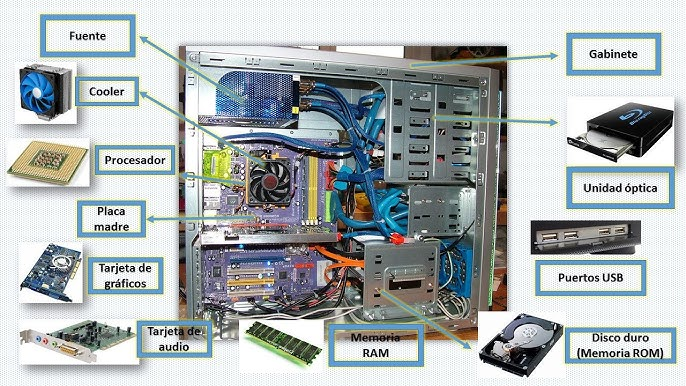

# Asignatura 3DEVs
## Proyecto de App
### Eduardo Guerrero
Nos esta enseñando a hacer juegos pero ahora en movil, cosa que aun no habiamos hecho. Esta interesante por ahora llevamos solo visuales de como sera nuestro juego pero ahi vamos.

## Programacion en lenguajes interpretados
### Jonathan Miranda
Nos esta ensenando a programar en visual studio code, y a usar git y github de la mano. 

## Diseño de videojuegos
### Ana Olivar
La materia practicamente es de aprender a diseñar desde cero un juego, nos esta enseñando todo lo que se debe incluir en una especie de GDD para que este realmente completo con todo detalle, igual nos enseño lo basico de unity y unreal

## Principios de Composicion y Diseño 
### Roberto Melo
Estamos aprendiendo a usar Photoshop la verdad esta muy interesante, por ahora estamos llevando puro photoshop y me esta gustando, nos enseño ya a fusionar distintas imagenes y todo

## Ingles Tecnico
### Oropeza
Nos esta enseñando mas que nada sobre como vendernos, speech en ingles, marketing, frases para captar la atencion y todo eso.

## Sistemas Operativos
### Alcides Albora
La verdad no estoy aprendiendo mucho de esta materia, creo que son cosas que ya hemos visto y asi. La clase pasada nos enseño sobre discos duros como eran antes y como son ahora pero no fue mucho de mi interes. Habla mucho sobre las cosas internas de una pc, como se arman pero son cosas de las que ya tengo conocimiento y esos temas se repiten  muy amenudo. 

